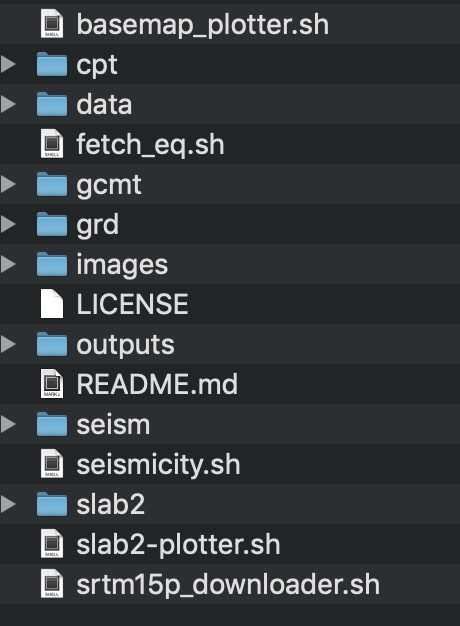
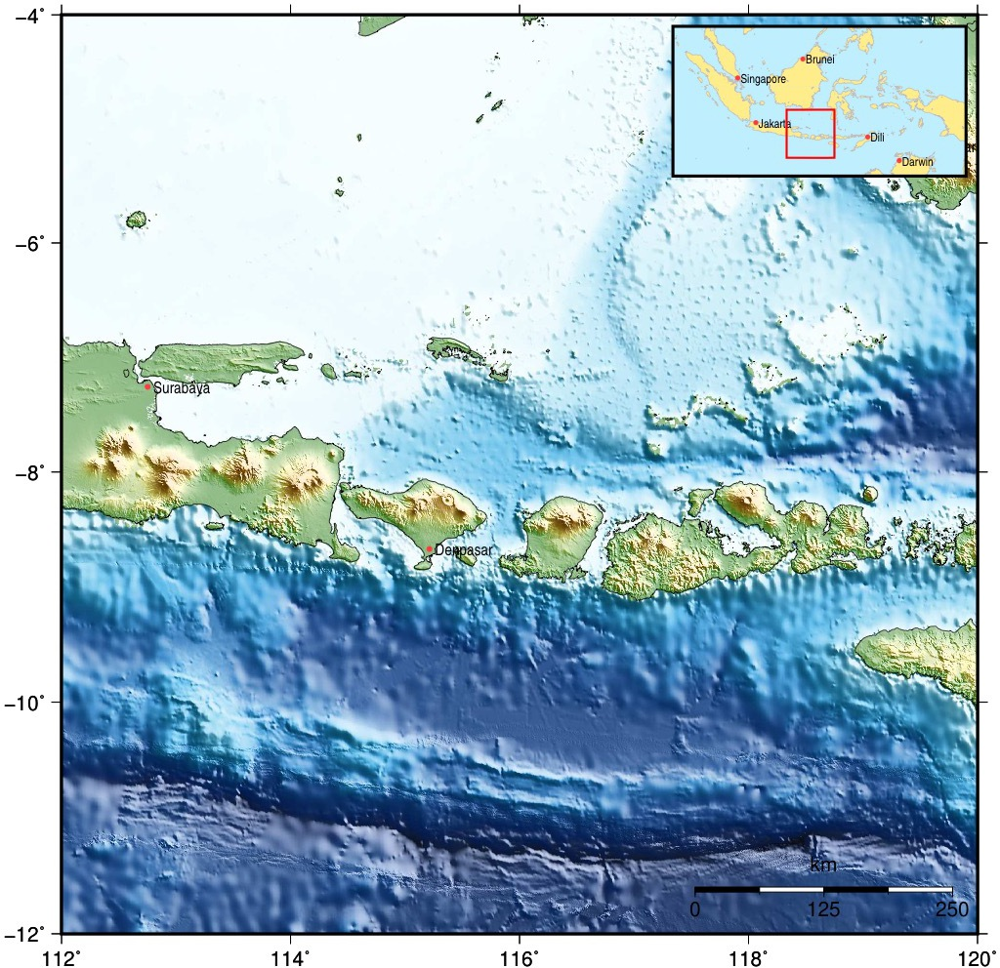
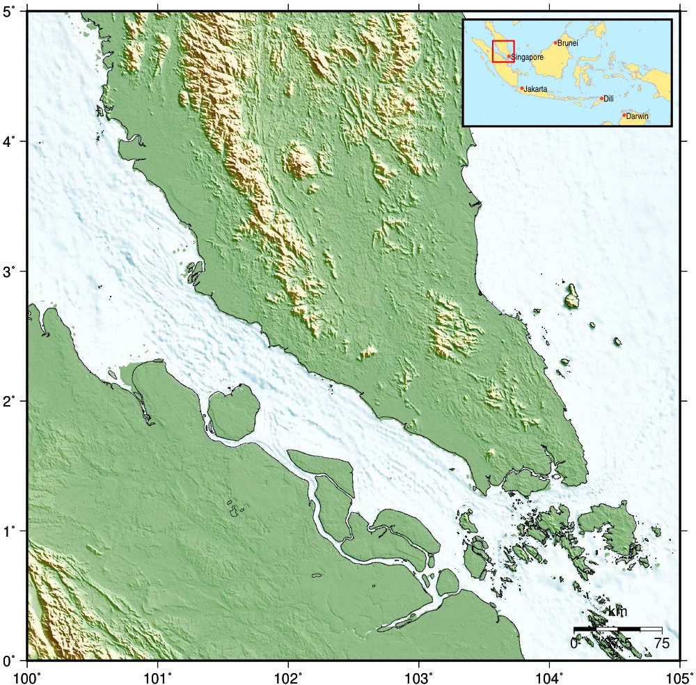
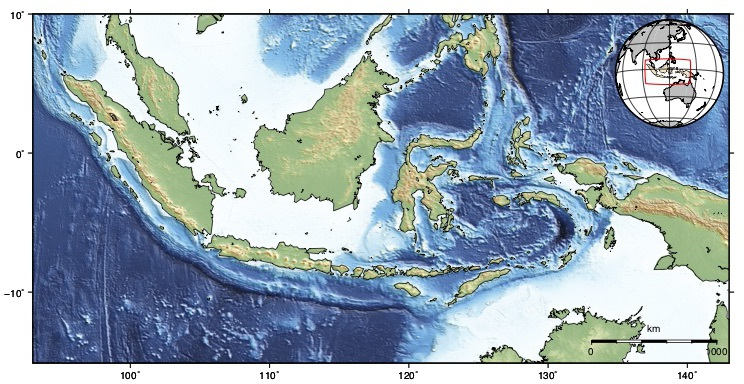
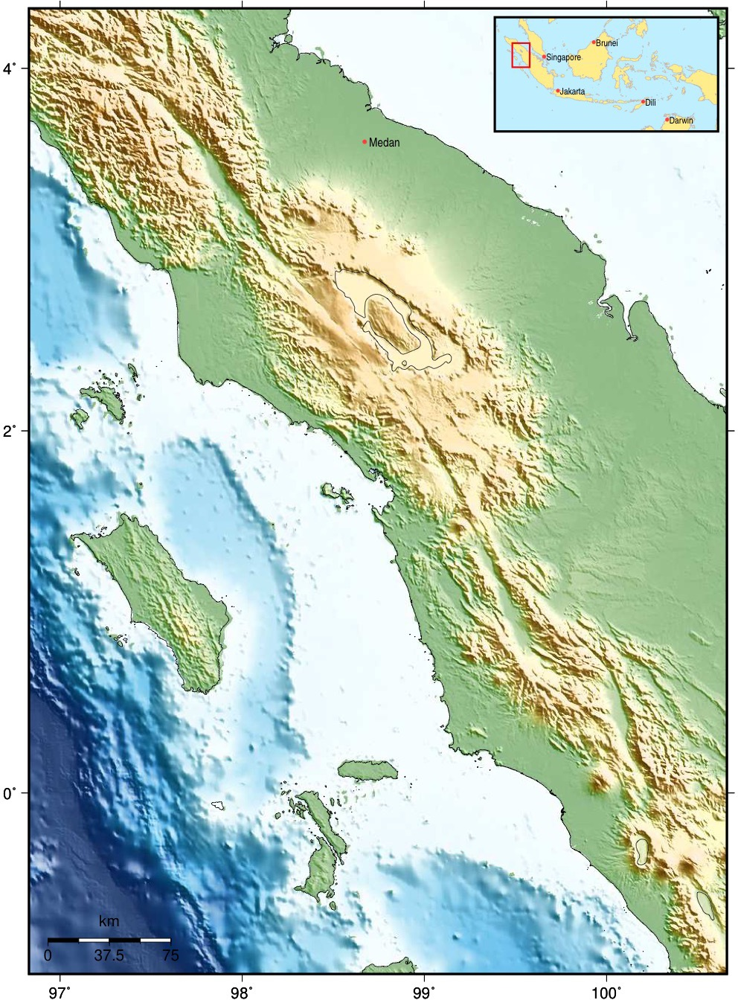
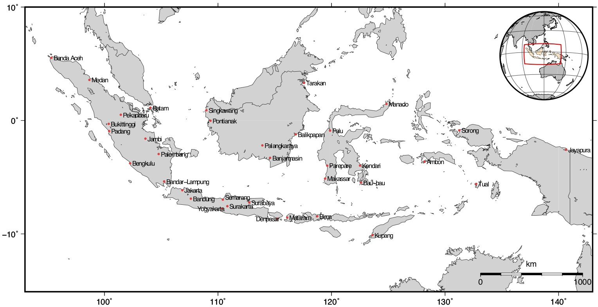
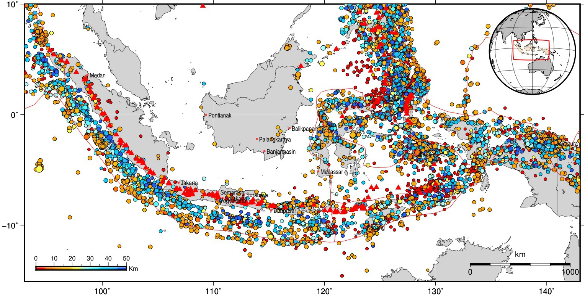
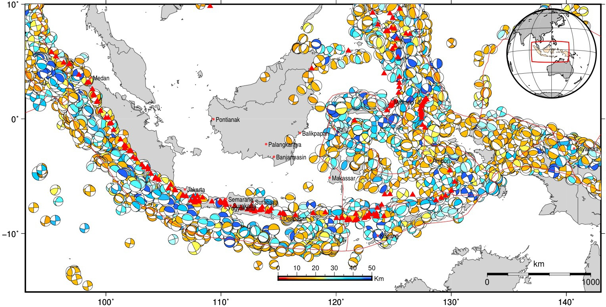

# GMT Basemap Plotter

by **Hendro Nugroho**

## **Purpose:**

Quickly plot multiple basemaps from inputted region of interests (ROIs) using [GMT version 5.4.5](https://github.com/GenericMappingTools/gmt/releases/tag/5.4.5) on A4 size media (595 by 842 points ~ 793.34 by 1,122.67 pixels). Grid file included is only covering Indonesia region [Lon.: 93-143; Lat.:-15-10].

## **Features:**
   * Plot is designed to maximize space usage on A4 size media [8.27 x 11.69 in or 210 x 297 mm; gmt set PS_MEDIA A4].
   * Portrait and landscape mode is automatically set based on simple length/width ratio of Longitude/Latitude.
   * Portrait mode produces a maximum of 6.25 inches plot with 2.02 inches total margin (left and right margin).
   * Landscape mode outputs a maximum of 9.67 inches plot with similar margin size to the portrait mode.
   * If script couldn't find grid file on your computer, it will give you option to download it from [topex.ucsc.edu](ftp://topex.ucsd.edu/pub/srtm15_plus) or continue plotting the basemap without DEM.
   * Main input file is **maps.txt** in which output filenames, ROIs, PoF switch (Plain [0] or Fancy [1] map frame switch), iPos (inset map position), sPos (map scale position) are set.
   * Coastline resolution, annotation and minor tick, and map scale are determined from total length of ROI Longitude/Latitude. Following table shows the assigned values:

| ROI length | Coastline Resolution | Annotation & Minor Tick | Map Scale |
|:----------:|:--------------------:|:-----------------------:|:---------:|
| 60 - >20   | Low                  | 10&deg;              | 1000 km   |
| 20 - >10   | Intermediate         |  5&deg;              |  500 km   |
| 10 -  >5   | High                 |  2&deg;              |  250 km   |
|  5 -  >2   | Full                 |  1&deg;               |   75 km   |
|  2 -  >1   | Full                 |  0.5&deg;            |   25 km   |
|  1 -  >0   | Full                 |  0.25&deg;           |   10 km   |

   * Timor-Leste boundary is added to include Oecussi enclave.
   * **Seismicity** data downloaded from [IRIS Wilber3](http://ds.iris.edu/wilber3/find_event) website with the following criteria
      1. Covering Longitude from 93&deg; to 143&deg; East, Latitude from -15&deg; South to 10&deg; North,
      2. Events dated from 1971-01-01 to 2020-04-16
      3. Magnitude >3.0 with depth ranges from 0-300 km [shallow to medium earthquakes]. There are 167349 total events recorded.
      4. Earthquake events grouped into two categories: *Shallow Events (0-50 km depth)* and *Intermediate Events (>50-300 km depth)*,
      5. The features are activated by switches (**s1=1** and **s2=1** representing shallow and intermediate events, respectively).
* **Fetch_eq.sh** added to get earthquake data from NEIC-USGS. Included are earthquake data from 1970 to June, 2nd 2020. Earthquake data criteria are similar to those from IRIS.
* **Volcanoes** data are downloaded from Global Volcanism Program ([Global Volcanism Program, 2013. Volcanoes of the World, v. 4.7.6. Venzke, E (ed.). Smithsonian Institution]( https://doi.org/10.5479/si.GVP.VOTW4-2013). Downloaded 25 Feb 2019). Plotting the feature require switch activation (**v=1**).
* [**Global CMT**](https://www.globalcmt.org) data is available from 1976 to 2016 ( [Dziewonski et al., 1981](https://doi:10.1029/JB086iB04p02825); [Ekstrom et al., 2012](https://doi:10.1016/j.pepi.2012.04.002) ) and it is activated using **g1=1** and **g2=1** switches.
* Option to use [**Scientific colour-maps.** Crameri, F. (2018)](http://doi.org/10.5281/zenodo.1243862) palette (pls. Look under **cpt/scm6** folder). User need to implement it in the codes manually.
* Plate boundaries by [Bird (2003)](https://doi.org/10.1029/2001GC000252) can be activated using **p=1** switch. Alternatively, NUVEL plate boundaries are available for plotting by switching the plate variable.
* Now you can plot slab2.0 model ([Hayes et al., 2018](https://doi.org/10.1126/science.aat4723)) using **slab2-plotter.sh** script provided.

## **Files and Folders:**

Currently there are five main scripts: **_basemap_plotter.sh_**, **seismicity.sh**,**_srtm15p_downloader.sh_**, **slab2-plotter.sh**, and **fetch_eq.sh** in the main folder beside the **_README.md_** (This file). Eight folders are there to put cpt files (**cpt** folder), grid files (**grd** folder), various input data (**data** folder), global cmt data (**gcmt** folder), seismic event data (**seism** folder), postscript results (**outputs**), slab 2.0 data (**slab2** folder), and images of this document (**images** folder). Grid files inside grd folder are  tracked and uploaded to GitHub LFS due to their sizes.

<div align="center"></div>

<div align="center"><b>Figure 1.</b> Files and folders structure</div>

## **Examples:**
It is quite simple to create several basemaps. Let say we want to have eight basemaps plotted: **Bali and Lombok Island** to the extent of Java Trench, **Bali Island**, **Lombok Island**, **Banda Arc** transitional zone, **Singapore**, **Indonesia**, **Aceh Province**, and **North Sumatra Province**. First, we need to edit **maps.txt** located in **data folder** and input six parameters: 1) file names, minimum longitudes, maximum longitudes, minimum latitudes, maximum latitudes, logical switch for map frames, inset position and scale position. Following is the content input file listed eight maps we are going to make:

```
Bali_and_Lombok.ps  112 120 -12 -4   0   TR  BR
Bali.ps 114.4   115.8   -9.05    -7.95    0   BL  TR
Lombok.ps  115.25 117 -9.2 -7.9   1   TL  BR
Banda.ps   118.5   127.5   -12.5   -7   1   BR  BC
Singapore.ps 100    105 0   5   0   TR  BR
Indo.ps 93  143 -15 10  0   TR  BR
Aceh.ps 94.88   98.32   1.28    6.21    0   BL  BR
Sumut.ps   96.83   100.66  -1.00    4.33    0   TR  BL
```

You should have two grid files when you clone this repository. But if you don't get/have SRTM15 plus grid file, **_srtm15p_downloader.sh_** will download and prepare the file in the grd directory. Please be patient **SRTM15+V2.1.nc** is a big file (~6Gb). After downloading process is completed, two new grid files will be created: **srtm15idn.grd** (DEM file covering Indonesia region) and **srtm15idni.grd** (for illumination).

To run the script independently, simply type in the script name in the terminal windows (or otherwise script will automatically called from **basemap_plotter.sh**):

``` bash
$ ./srtm15p_downloader.sh

SRTM15+V2.1 file is available to download from topex.ucsd.edu
Do you wish to get it now?
1) Yes
2) No
3) Exit
#? 1
~/gmt-basemap-plotter/grd ~/basemap_plotter
Downloading SRTM15 plus version 2.1 into /Users/seismo/gmt-basemap-plotter/grd
Depending on your internet speed, the process will take some times to complete
.
. showing details of downloading process and progress
.
Working inside /Users/seismo/gmt-basemap-plotter/grd to cut the grid file
and to create illumination file
Done! Going back to main directory now
```

Running the main script below will produce maps we wanted.

```bash
$ ./basemap_plotter.sh

Plotting [ Bali_and_Lombok.ps ] basemap

Plotting [ Bali.ps ] basemap

Plotting [ Lombok.ps ] basemap

Plotting [ Banda.ps ] basemap

Plotting [ Singapore.ps ] basemap

Plotting [ Indo.ps ] basemap

Plotting [ Aceh.ps ] basemap

Plotting [ Sumut.ps ] basemap

Done!

$
```

Following are the results:



<div align="center"><b>Figure 2.</b> Basemap of Bali and Lombok Island with plain map frames.</div>


<div align="center"><b>Figure 3.</b> Basemap of Bali Island in fancy map frames.</div>


<div align="center"><b>Figure 4.</b> Basemap of Lombok Island plotted in landscape mode inside fancy frames.</div>



<div align="center"><b>Figure 5.</b> Basemap of Singapore region plotted automatically in portrait mode using plain map frames.</div>



<div align="center"><b>Figure 6.</b> Basemap of Indonesia region plotted automatically in landscape mode using plain map frames.</div>


<div align="center"><b>Figure 7.</b> Basemap of Aceh Province plotted automatically in portrait mode using plain map frames.</div>



<div align="center"><b>Figure 8.</b> Basemap of North Sumatra Province (Propinsi Sumatera Utara) plotted automatically in portrait mode using plain map frames.</div>

## **Other Features:**



<div align="center"><b>Figure 9.</b> Basemap of Indonesia region plotted automatically in lanscape mode without DEM using plain map frames. Major cities Indonesia are plotted.</div>



<div align="center"><b>Figure 9.</b> Basemap of Indonesia region plotted automatically in lanscape mode without DEM using plain map frames. Shallow crustal event (depth of < 50km) in 5 year periods (2015-2020) are plotted on the map.</div>



<div align="center"><b>Figure 10.</b> Basemap of Indonesia region plotted automatically in lanscape mode without DEM using plain map frames. GCMT data, volcanoes and plate boundaries are plotted on the map.</div>


<div align="center"><b>Figure 11.</b> Basemap of Indonesia region plotted automatically in lanscape mode in plain map frames. Gray10 color palette is implemented.</div>

## **REFERENCES:**

Bird, P. (2003). An updated digital model of plate boundaries. *Geochemistry, Geophysics, Geosystems*, *4*(3), https://doi.org/10.1029/2001GC000252

Crameri, F. (2018). Scientific colour-maps. Zenodo. http://doi.org/10.5281/zenodo.1243862

Dziewonski, A. M.,  Chou, T.‐A., and  Woodhouse, J. H. ( 1981),  Determination of earthquake source parameters from waveform data for studies of global and regional seismicity, *J. Geophys. Res.*,  86( B4),  2825– 2852, doi:[10.1029/JB086iB04p02825](https://doi.org/10.1029/JB086iB04p02825).

Ekström, G., Nettles, M., & Dziewoński, A. M. (2012). The global CMT project 2004–2010: Centroid-moment tensors for 13,017 earthquakes. *Physics of the Earth and Planetary Interiors*, *200*, 1-9. doi: [10.1016/j.pepi.2012.04.002](https://doi.org/10.1016/j.pepi.2012.04.002)

Hayes, G. P., Moore, G. L., Portner, D. E., Hearne, M., Flamme, H.,  Furtney, M., & Smoczyk, G. M. (2018). Slab2, a comprehensive  subduction zone geometry model. *Science*, *362*(6410), 58-61. doi: https://doi.org/10.1126/science.aat4723

Wessel, P.,  Smith, W. H. F.,  Scharroo, R.,  Luis, J. and  Wobbe, F. ( 2013),  Generic Mapping Tools: Improved Version Released, *Eos Trans. AGU*,  94( 45),  409, https://doi.org/10.1002/2013EO450001

